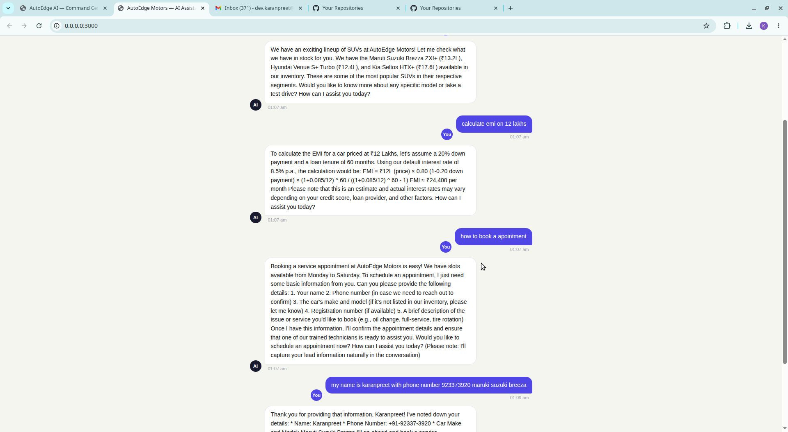
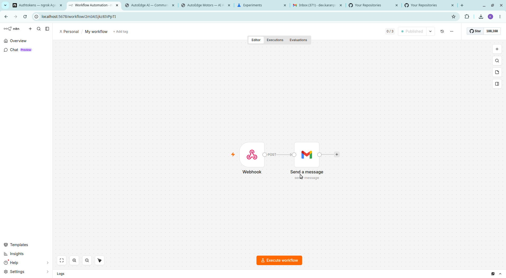
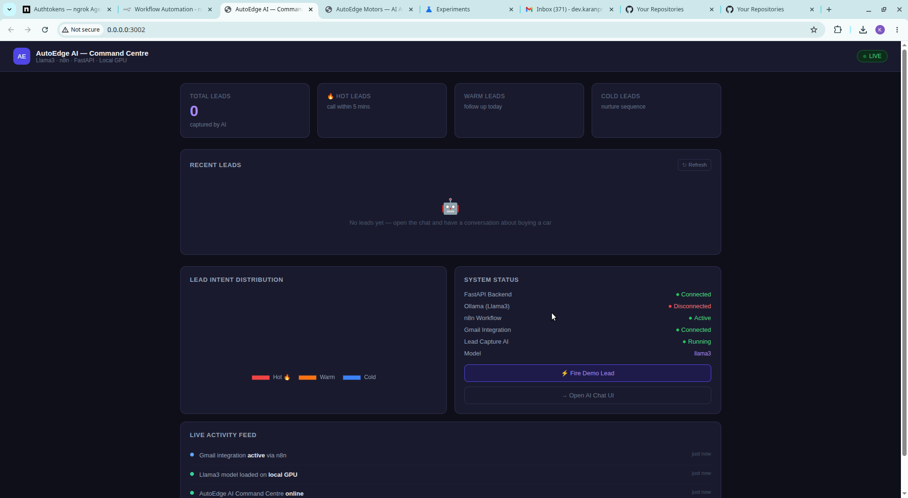
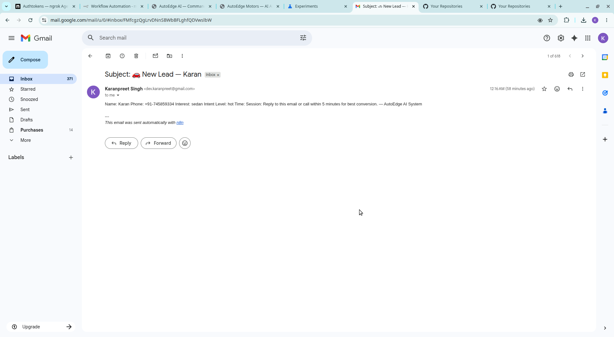

# 🚗 AutoEdge AI — Dealership Automation System

A fully local, GPU-powered AI automation stack for automotive dealerships. Built as a proof-of-concept demonstrating end-to-end AI integration across chat, voice, lead capture, workflow automation, and real-time dashboards.

> **Built in 24 hours as an interview POC** — demonstrating skills in LLM integration, workflow automation, voice AI, CRM pipelines, and full-stack deployment.

---

## 🎯 What This Demonstrates

| Skill | Implementation |
|---|---|
| LLM Integration | Llama3 via Ollama (local GPU, zero API cost) |
| AI Agent Design | Custom system prompt, inventory knowledge, lead detection |
| Workflow Automation | n8n webhook → Gmail alert pipeline |
| Voice AI | VAPI + custom LLM backend (OpenAI-compatible) |
| CRM Integration | Auto lead capture → webhook → any CRM via n8n |
| API Development | FastAPI with REST endpoints |
| Frontend | Vanilla JS chat UI with voice input |
| Dashboard | Real-time lead analytics with Chart.js |
| Public Exposure | ngrok tunnel for VAPI/webhook integration |

---

## 🏗️ Architecture

```
┌─────────────────────────────────────────────────────┐
│                   Customer Layer                     │
│         Chat UI (port 3000) │ Voice (VAPI)          │
└──────────────────┬──────────────────────────────────┘
                   │
┌──────────────────▼──────────────────────────────────┐
│              FastAPI Backend (port 8000)             │
│  /chat  │  /vapi/chat/completions  │  /leads        │
│              Llama3 via Ollama (local GPU)           │
└──────────────────┬──────────────────────────────────┘
                   │ Lead detected
┌──────────────────▼──────────────────────────────────┐
│                 n8n Workflow Engine                  │
│         Webhook → Gmail │ HubSpot │ WhatsApp        │
└─────────────────────────────────────────────────────┘
                   │
┌──────────────────▼──────────────────────────────────┐
│            Dashboard (port 3002)                    │
│     Live leads, intent chart, system status        │
└─────────────────────────────────────────────────────┘
```

---














## ✨ Features

### AI Chat Agent (Aria)
- Answers inventory queries across 10+ car models
- Calculates EMI in real-time (8.5% p.a., 60 months)
- Books test drives and service appointments
- Speaks Hindi and English
- Voice input via Web Speech API (Chrome)

### Automatic Lead Capture
- AI detects buying intent mid-conversation
- Extracts name, phone, interest, intent level (hot/warm/cold)
- Hidden `<LEAD_CAPTURE>` tag — invisible to customer
- Fires to n8n webhook instantly

### n8n Automation Pipeline
- Webhook receives lead data
- Gmail alert fires within seconds
- Same pipeline connects to HubSpot, WhatsApp, Slack

### Voice AI (VAPI)
- Inbound call handler powered by local Llama3
- OpenAI-compatible `/vapi/chat/completions` endpoint
- Voice-optimised responses (short, natural, question-ended)
- Lead capture works on calls too

### Real-time Dashboard
- Live lead count (hot / warm / cold)
- Intent distribution donut chart
- System status (Ollama, n8n, Gmail)
- Auto-refreshes every 10 seconds
- One-click demo lead generator

---

## 🚀 Quick Start

### Prerequisites
- Ubuntu / Linux machine with GPU
- Python 3.11+, Node.js, conda
- Chrome browser (for voice input)

### 1. Install Ollama & pull model
```bash
curl -fsSL https://ollama.com/install.sh | sh
ollama pull llama3
```

### 2. Install n8n
```bash
npm install -g n8n
```

### 3. Install ngrok
```bash
# Sign up at ngrok.com, then:
ngrok config add-authtoken YOUR_TOKEN
```

### 4. One-click launch
```bash
chmod +x start.sh
./start.sh
```

This opens all services in separate terminals automatically.

### 5. Manual launch (alternative)
```bash
# Terminal 1 — Backend
cd backend && conda activate automation
uvicorn main:app --host 0.0.0.0 --port 8000 --reload

# Terminal 2 — n8n
NODE_OPTIONS="--dns-result-order=ipv4first" n8n start

# Terminal 3 — ngrok
ngrok http 8000

# Terminal 4 — Dashboard
cd dashboard && python -m http.server 3002

# Terminal 5 — Chat UI
cd frontend && python -m http.server 3000
```

---


## 🌐 Service URLs

| Service | URL |
|---|---|
| Chat UI | http://localhost:3000 |
| Dashboard | http://localhost:3002 |
| API Docs | http://localhost:8000/docs |
| n8n Workflows | http://localhost:5678 |
| Health Check | http://localhost:8000/health |
| Leads API | http://localhost:8000/leads |

---

## 📡 API Reference

### POST /chat
Main chat endpoint.
```json
{
  "messages": [{"role": "user", "content": "Show me SUVs under 20 lakhs"}],
  "session_id": "session-123"
}
```

### POST /vapi/chat/completions
OpenAI-compatible endpoint for VAPI voice integration.

### GET /leads
Returns all captured leads with intent breakdown.

### GET /health
Returns system status including Ollama connectivity.

---

## 🔧 Configuration

**Change LLM model** — in `backend/main.py`:
```python
MODEL = "llama3"  # or "mistral", "llama3.1", etc.
```

**Connect to HubSpot** — in n8n, add HubSpot node after webhook, map fields:
- `body.name` → Contact First Name
- `body.phone` → Phone Number
- `body.interest` → Deal Name

**Connect WhatsApp** — add Twilio node in n8n:
- From: `whatsapp:+14155238886`
- To: `whatsapp:+91XXXXXXXXXX`
- Body: `New lead: {{$json.body.name}} interested in {{$json.body.interest}}`

---

## 📁 Project Structure

```
dealership-ai/
├── backend/
│   ├── main.py              # FastAPI server + all endpoints
│   └── requirements.txt     # Python dependencies
├── frontend/
│   └── index.html           # Chat UI with voice input
├── dashboard/
│   └── index.html           # Real-time analytics dashboard
├── start.sh                 # One-click launcher
└── README.md
```

---

## 🗺️ Roadmap / Production Extensions

- [ ] PostgreSQL for persistent lead storage
- [ ] HubSpot CRM native integration
- [ ] WhatsApp Business API (Twilio)
- [ ] Multi-dealership support (tenant isolation)
- [ ] Call recording + AI summary (VAPI webhook)
- [ ] Docker Compose for one-command deployment
- [ ] SMS follow-up automation
- [ ] Inventory sync from DMS (CDK/DealerSocket API)

---

## 🛠️ Tech Stack

- **LLM**: Llama3 8B via Ollama
- **Backend**: FastAPI, Python 3.11, httpx
- **Voice AI**: VAPI (OpenAI-compatible custom LLM)
- **Automation**: n8n (self-hosted)
- **Frontend**: Vanilla JS, Web Speech API
- **Charts**: Chart.js
- **Tunnel**: ngrok
- **Email**: Gmail via Google OAuth + n8n

---

## 👤 Author

Built by Karanpreet Singh as an AI Automation & Integration POC.